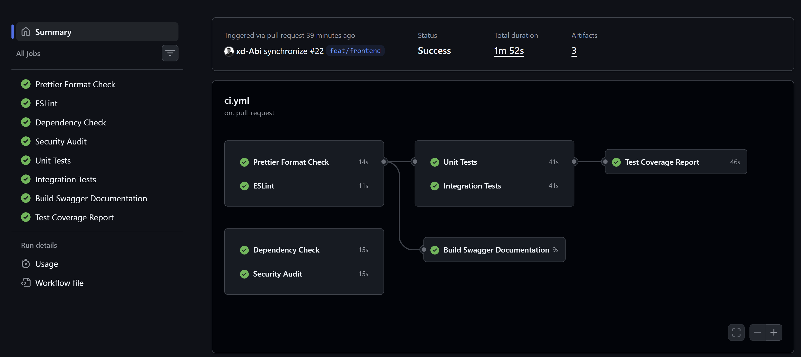

## CI Pipeline – Dokumentation

### Übersicht CI Pipeline

## Zweck der Pipeline

Diese CI Pipeline stellt sicher, dass der Code bei jeder Änderung automatisch geprüft wird.
Dabei werden Formatierung, Code-Qualität, Tests, Sicherheit und Dokumentation überprüft.
So wird gewährleistet, dass der Code stabil, sauber und nachvollziehbar bleibt.

### Auslöser (Triggers)

Die Pipeline wird automatisch gestartet bei:

* **Push** auf die Branches:

  * `main`
  * `develop`
  * `release/**`
  * `hotfix/**`
* **Pull Requests** auf:

  * `main`
  * `develop`
* **Manueller Start** (`workflow_dispatch`)

### Umgebung

* **Node.js Version:** 20
* Alle Jobs laufen auf **Ubuntu** GitHub Runnern
* Arbeitsverzeichnis: `./Code`

### Pipeline-Ablauf (Jobs)

#### 1. Prettier Format Check

* Prüft, ob der Code korrekt formatiert ist
* Verhindert unübersichtlichen oder inkonsistenten Code

#### 2. ESLint

* Überprüft den Code auf Fehler und Best Practices
* Hilft, logische und strukturelle Probleme früh zu erkennen

#### 3. Unit Tests

* Führt Unit Tests für alle Endpoints aus
* Nutzt eine isolierte MongoDB Test-Datenbank
* Startet nur, wenn Formatierung und Linting erfolgreich waren

#### 4. Integration Tests

* Testet das Zusammenspiel mehrerer Komponenten
* Verwendet ebenfalls eine MongoDB Test-Umgebung
* Startet parallel zu den Unit Tests

#### 5. Test Coverage Report

* Führt Tests mit Coverage aus
* Erstellt einen Coverage-Report
* Der Report wird als **Artifact** gespeichert und kann heruntergeladen werden

#### 6. Swagger Dokumentation

* Erstellt automatisch die Swagger API-Dokumentation
* Die generierte `swagger.json` wird als Artifact gespeichert
* Ermöglicht eine einfache API-Übersicht

#### 7. Dependency Check

* Prüft, ob `package-lock.json` korrekt ist
* Listet veraltete Abhängigkeiten auf
* Zeigt installierte Pakete an

#### 8. Security Audit

* Führt `npm audit` aus
* Erkennt bekannte Sicherheitslücken
* Erstellt einen Audit-Report als Artifact

### Branching-Strategie und CI-Integration

* **develop:** laufende Entwicklung, vollständige CI-Prüfung
* **main:** stabile Version, alle Checks müssen bestehen
* **release / hotfix:** ebenfalls vollständig in die CI eingebunden
* Pull Requests lösen automatische Prüfungen aus
